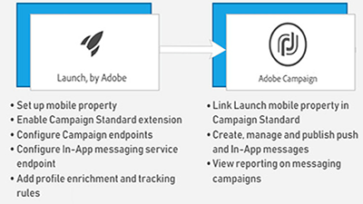

# Panoramica

Adobe Campaign offre una piattaforma per la progettazione di esperienze cliente multicanale e fornisce un ambiente per l&#39;orchestrazione visiva delle campagne, la gestione delle interazioni in tempo reale e l&#39;esecuzione su più canali. Questa guida utente contiene video ed esercitazioni sulle numerose funzioni e funzionalità di Adobe Campaign Standard.

## Novità

* **[Attività API esterna](/help/managing-processes-and-data/data-management-activities/external-api-activity.md)**    
   *Scoprite come configurare ed eseguire un flusso di lavoro con l&#39;attività API esterna.*

* **[Sostituzione profilo - Verifica dei messaggi e-mail tramite profili di destinazione](/help/communication-channels/email/profile-substitution.md)**    
   *Scopri come inviare una prova per la revisione con l&#39;esatta rappresentazione del messaggio che il profilo riceverà.*

* **[Pannello di controllo - Gestione record Google TXT](/help/administrating/control-panel/google-txt-record-management.md)**    
   *Scopri come aggiungere il record di verifica del sito Google TXT a tutti i tuoi sottodomini utilizzati per inviare e-mail agli indirizzi GMAIL tramite il Pannello di controllo della campagna.*

* **[Esercitazione: Guida introduttiva alle notifiche push per Android](https://docs.adobe.com/content/help/en/campaign-standard-learn/getting-started-with-push-notifications-android/introduction.html)**    
   *Questa esercitazione illustra i passaggi necessari per inviare notifiche push da Adobe Campaign e ricevere queste notifiche nell&#39;app Android.*

## Prezzi del personale

<table>
<tr>
  <td>
    
    

      <a href="./communication-channels/mobile/in-app/in-app-message-overview.md">
    <strong>Messaggistica in-app (esercitazione)</strong>
    </a>
    

    

    <em>Messaggistica in-app è un canale che consente di visualizzare un messaggio quando l'utente è attivo all'interno di un'applicazione mobile.</em>
    

  </td>
   <td>
    
    

      <a href="./designing-content/email-designer/email-designer-overview.md">
    <strong>Designer e-mail (video)</strong>
    </a>
    

    

    <em>Il designer e-mail consente di creare in modo rapido e semplice messaggi e-mail personalizzati individualmente.</em>
    

  </td>
  <td>
    
    

      <a href="./designing-content/product-listings-in-transactional-email.md">
    <strong>Elenco prodotti (esercitazione)</strong>
    </a>
    

    

    <em>Crea e-mail transazionali con un elenco di prodotti e offerte. </em>
    

  </td>
</tr>
</table>

## Risorse aggiuntive

* [Documentazione](https://docs.adobe.com/content/help/en/campaign-standard/using/campaign-standard-home.html)
