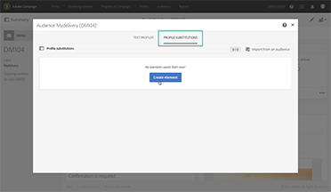
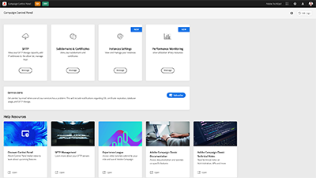
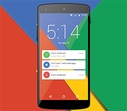

# Panoramica di Adobe Campaign Standard

Adobe Campaign fornisce una piattaforma per la progettazione di customer experience cross-channel e fornisce un ambiente per l’orchestrazione visiva delle campagne, la gestione delle interazioni in tempo reale e l’esecuzione cross-channel. Questa guida utente contiene video e tutorial sulle numerose funzioni e caratteristiche di Adobe Campaign Standard.

## Novità

* **[Pianificare i messaggi](/help/communication-channels/email/schedule-messages.md)**

   *Scopri come pianificare una consegna e-mail.*

* **[Inviare una bozza](/help/communication-channels/email/send-a-proof.md)**

   *Scopri come verificare un messaggio e-mail prima di inviarlo ai destinatari finali.*

* **[Dieci best practice per il successo Adobe Campaign per gli addetti al marketing](/help/strategy/10-best-practices-for-marketers.md)**

   *Scopri dieci best practice per aiutare i professionisti di Adobe Campaign a sbloccare e accelerare la trasformazione del consumatore digitale e una migliore esperienza per i clienti.*

## Scelti dallo staff

<table>
<tr>
  <td>
    
    

      <a href="./communication-channels/email/profile-substitution.md">
    <strong>Profile Substitution - Verifica dei messaggi e-mail tramite profili di destinazione (video)</strong>
    </a>
    

    

    <em>Scopri come inviare una bozza per la revisione con l’esatta rappresentazione del messaggio che verrà ricevuto dal profilo</em>.
    

  </td>
   <td>
    
    

    <a href="https://experienceleague.adobe.com/docs/control-panel-learn/tutorials/control-panel-overview.html?lang=it">
    <strong>Pannello di controllo (video)</strong>
    </a>
    

    

    <em> In qualità di amministratore, aumenta l’efficienza gestendo le impostazioni e monitorando gli utilizzi delle istanze con il Pannello di controllo.</em>
    

  </td>
  <td>
    
    

      <a href="https://experienceleague.adobe.com/docs/campaign-standard-learn/getting-started-with-push-notifications-android/introduction.html?lang=it">
    <strong>Tutorial: guida introduttiva alle notifiche push per Android™</strong>
    </a>
    

    

    <em>Questo tutorial illustra i passaggi necessari per l’invio di notifiche push da Adobe Campaign e la ricezione di tali notifiche all’interno dell’app Android™</em>.
    

  </td>
</tr>
</table>

## Risorse aggiuntive

* [Documentazione](https://experienceleague.adobe.com/docs/campaign-standard/using/campaign-standard-home.html?lang=it)
